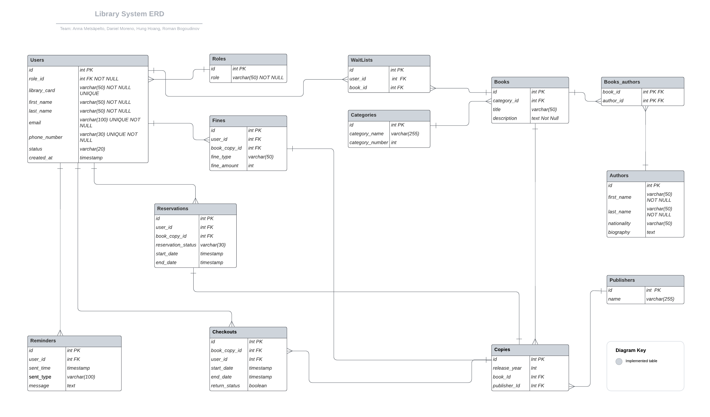

# Backend project

1. Our team has created a Library management system
Main features:
    - Users
    - Books
    - Fines
    - Authors
    - Reservations
    - Waitlist

## Completed parts

1. Design of the API endpoints created in a markdown file api_endpoints.md
2. ERD diagram for database

## Library Management System

1. Group members:
- Roman Bogoudinov
- Daniel Moreno
- Hung Hoang
- Anna Metsäpelto

2. Responsibilities
- Planning - Team
- ERD - Team
### Endpoints and SQL queries:
- Users - Hung Hoang
- Books - Roman Bogoudinov
- Authors, Publishers - Anna Metsäpelto
- Actions, Fines, Book actions, Auth JWT - Daniel Moreno 
